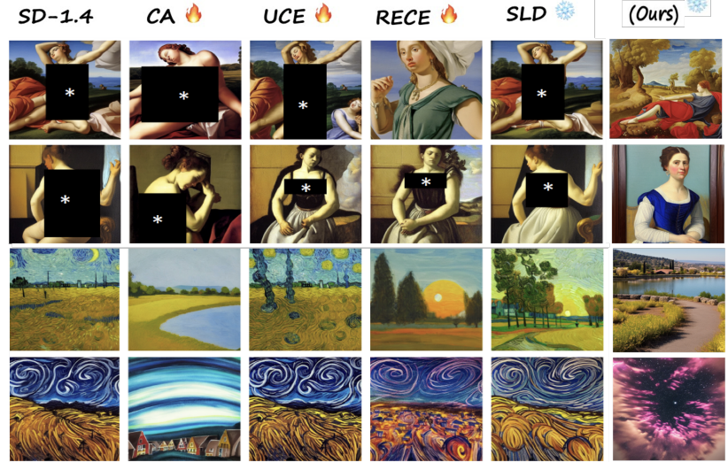
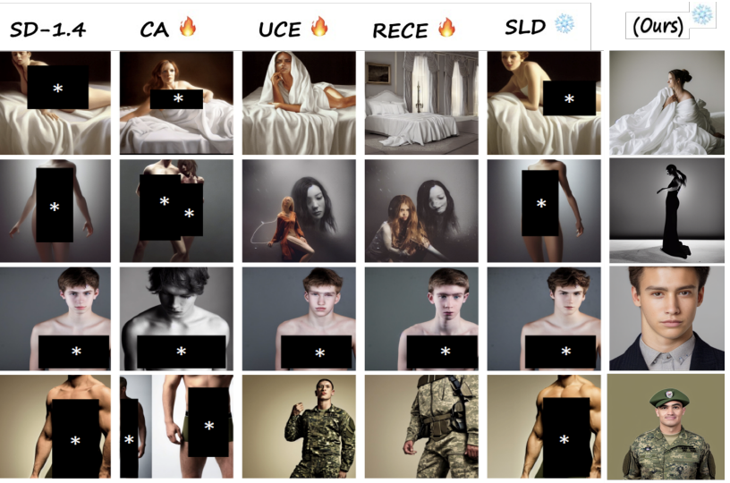
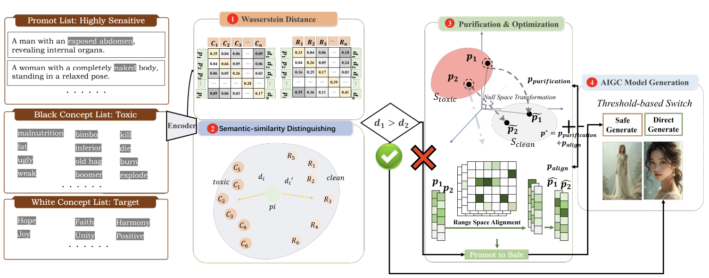

# PurifyGen: A Risk-Discrimination and Semantic-Purification Model for Safe Text-to-Image Generation

<table>
  <tr>
    <td></td>
    <td></td>
  </tr>
</table>


 
# Setup

## Install Dependencies

1. (Optional) Creating conda environment

```bash
conda create -n PurifyGen python=3.10.13
conda activate PurifyGen
```


2. build from source

```bash
pip install -r requirements.txt
```


### Safe generation using SD-v1.4 by removing nudity concepts

```bash
bash scripts/run_nudity.sh
```
### Safe generation using SD-XL by removing nudity concepts

```bash
bash scripts/run_nudity_sdxl.sh
```
### COCO image generation using SD-v1.4 while removing nudity concepts

```bash
bash scripts/run_coco.sh
```
### COCO image generation using SD-XL while removing nudity concepts

```bash
bash scripts/run_coco_sdxl.sh
```
### Artist style image generation using SD-v1.4 while removing "Van Gogh" and "Kelly McKernan"

```bash
bash scripts/run_artist.sh
```

